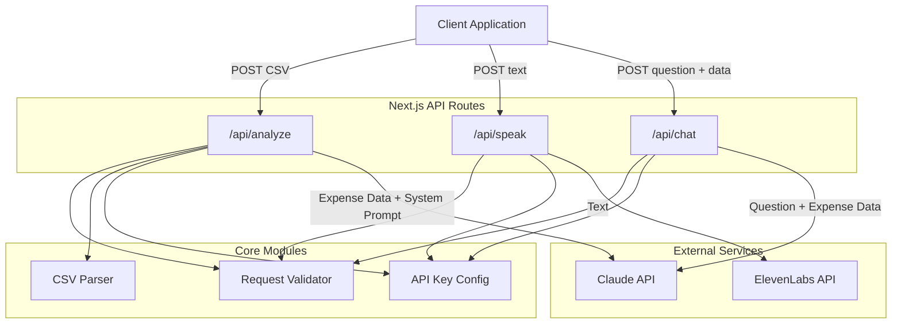

# Design Document

## Overview

ClearBooks API is a Next.js backend providing three POST endpoints for financial data analysis:

1. `/api/analyze` — Accepts CSV expense files, parses them, sends structured data to the Claude API for categorization and risk scoring, and returns a JSON result.
2. `/api/speak` — Accepts a text string and returns synthesized audio from the ElevenLabs API.
3. `/api/chat` — Accepts a question plus parsed expense data, queries the Claude API, and returns a plain-text answer.

All endpoints enforce POST-only access and validate inputs before calling external services. API keys for Claude and ElevenLabs are loaded from environment variables. The CSV parser is a standalone module that extracts transaction records, skips malformed rows, and supports round-trip fidelity.

## Architecture



### Design Decisions

- **Next.js API Routes**: Each endpoint is a standalone route handler in `pages/api/` (or `app/api/` with route handlers). This keeps the deployment simple — a single Next.js app serves everything.
- **Shared validation module**: A common `validateRequest` utility handles method checks and body parsing across all three endpoints, reducing duplication.
- **CSV Parser as a pure module**: The parser is a standalone function with no side effects, making it independently testable and suitable for property-based testing.
- **Environment variable config**: A single `getApiKeys()` function reads and validates env vars at request time, returning early with HTTP 500 if keys are missing.

## Components and Interfaces

### 1. CSV Parser (`lib/csvParser.ts`)

```typescript
interface ExpenseRecord {
  date: string;
  description: string;
  amount: number;
}

/**
 * Parses CSV content into expense records.
 * Skips rows with missing fields or non-numeric amounts.
 * Uses the first row as a header to map columns.
 */
function parseCSV(csvContent: string): ExpenseRecord[];

/**
 * Formats expense records back to CSV string.
 * Used for round-trip validation.
 */
function formatCSV(records: ExpenseRecord[]): string;
```

### 2. Request Validator (`lib/validator.ts`)

```typescript
interface ValidationResult {
  valid: boolean;
  error?: string;
  statusCode?: number;
}

/**
 * Validates that the request method is POST.
 */
function validateMethod(method: string | undefined): ValidationResult;

/**
 * Validates the analyze request body contains a CSV file.
 */
function validateAnalyzeBody(body: any): ValidationResult;

/**
 * Validates the speak request body contains a non-empty text field.
 */
function validateSpeakBody(body: any): ValidationResult;

/**
 * Validates the chat request body contains question and expenseData fields.
 */
function validateChatBody(body: any): ValidationResult;
```

### 3. API Key Config (`lib/config.ts`)

```typescript
interface ApiKeys {
  anthropicApiKey: string;
  elevenLabsApiKey: string;
}

/**
 * Reads API keys from environment variables.
 * Throws with a descriptive message if a required key is missing.
 */
function getApiKeys(required: ('anthropic' | 'elevenlabs')[]): ApiKeys;
```

### 4. Claude Service (`lib/claude.ts`)

```typescript
interface CategoryResult {
  categories: { name: string; total: number; transactions: number }[];
  riskScore: number;
  summary: string;
}

/**
 * Sends expense data to Claude API with the system prompt for categorization.
 */
async function analyzeExpenses(
  apiKey: string,
  expenseData: ExpenseRecord[]
): Promise<CategoryResult>;

/**
 * Sends a question and expense data to Claude API, returns plain text answer.
 */
async function chatAboutExpenses(
  apiKey: string,
  question: string,
  expenseData: ExpenseRecord[]
): Promise<string>;
```

### 5. ElevenLabs Service (`lib/elevenlabs.ts`)

```typescript
/**
 * Sends text to ElevenLabs API, returns audio buffer and content type.
 */
async function synthesizeSpeech(
  apiKey: string,
  text: string
): Promise<{ audio: Buffer; contentType: string }>;
```

### 6. API Route Handlers

- `pages/api/analyze.ts` — Orchestrates: validate method → validate body → check API key → parse CSV → call Claude → return CategoryResult
- `pages/api/speak.ts` — Orchestrates: validate method → validate body → check API key → call ElevenLabs → return audio
- `pages/api/chat.ts` — Orchestrates: validate method → validate body → check API key → call Claude → return plain text

## Data Models

### ExpenseRecord

| Field       | Type   | Description                          |
|-------------|--------|--------------------------------------|
| date        | string | Transaction date from CSV            |
| description | string | Transaction description from CSV     |
| amount      | number | Transaction amount (parsed numeric)  |

### CategoryResult

| Field      | Type     | Description                                    |
|------------|----------|------------------------------------------------|
| categories | array    | Array of `{ name, total, transactions }` objects |
| riskScore  | number   | Numeric risk level for the expense set         |
| summary    | string   | Human-readable summary of the analysis         |

### Request/Response Shapes

**POST /api/analyze**
- Request: `multipart/form-data` with a `file` field containing CSV content
- Success (200): `CategoryResult` JSON
- Errors: 400 (bad input), 405 (wrong method), 500 (missing key), 502 (upstream failure)

**POST /api/speak**
- Request: `{ "text": "string" }`
- Success (200): Audio binary with appropriate `Content-Type` header
- Errors: 400 (missing/empty text), 405 (wrong method), 500 (missing key), 502 (upstream failure)

**POST /api/chat**
- Request: `{ "question": "string", "expenseData": ExpenseRecord[] }`
- Success (200): Plain text with `Content-Type: text/plain`
- Errors: 400 (missing question or data), 405 (wrong method), 500 (missing key), 502 (upstream failure)


## Correctness Properties

*A property is a characteristic or behavior that should hold true across all valid executions of a system — essentially, a formal statement about what the system should do. Properties serve as the bridge between human-readable specifications and machine-verifiable correctness guarantees.*

### Property 1: CSV round-trip fidelity

*For any* array of valid ExpenseRecord objects, formatting them to CSV via `formatCSV` and then parsing the result via `parseCSV` SHALL produce an array of ExpenseRecord objects equivalent to the original.

**Validates: Requirements 5.5**

### Property 2: Valid CSV rows produce complete records

*For any* valid CSV string where every data row contains a date, description, and numeric amount, `parseCSV` SHALL return an array of ExpenseRecord objects where each record has a non-empty `date` string, a non-empty `description` string, and a finite numeric `amount`.

**Validates: Requirements 5.1, 1.1**

### Property 3: Invalid rows are skipped

*For any* CSV string containing a mix of valid rows and invalid rows (rows missing required fields or rows with non-numeric amount values), `parseCSV` SHALL return only records corresponding to the valid rows, and the count of returned records SHALL equal the count of valid input rows.

**Validates: Requirements 5.2, 5.3**

### Property 4: Header column order independence

*For any* permutation of the columns (date, description, amount) in the CSV header row, `parseCSV` SHALL produce the same ExpenseRecord values regardless of column ordering.

**Validates: Requirements 5.4**

### Property 5: CategoryResult response structure

*For any* valid CategoryResult returned by the Claude API mock, the Analyze_Endpoint response SHALL contain a JSON object with a `categories` array, a numeric `riskScore`, and a string `summary`.

**Validates: Requirements 1.3**

### Property 6: Non-POST method rejection

*For any* HTTP method that is not POST and *for any* of the three endpoints (analyze, speak, chat), the endpoint SHALL return an HTTP 405 status code.

**Validates: Requirements 6.1, 6.2, 6.3**

## Error Handling

### HTTP Status Code Strategy

| Status Code | Condition | Endpoints |
|-------------|-----------|-----------|
| 400 | Invalid/missing input (no file, empty text, missing fields, invalid CSV, no data rows) | All |
| 405 | Non-POST request method | All |
| 500 | Missing API key environment variable | All |
| 502 | External API (Claude or ElevenLabs) failure | analyze, speak, chat |

### Error Response Format

All error responses return JSON:

```json
{
  "error": "Descriptive error message"
}
```

### Error Handling Flow

1. **Method check** (first) — return 405 if not POST
2. **API key check** — return 500 if required key is missing
3. **Input validation** — return 400 with specific message for each validation failure
4. **External API call** — wrap in try/catch, return 502 on failure with upstream error context

### External Service Failures

- Claude API failures (network errors, rate limits, 5xx responses) → HTTP 502
- ElevenLabs API failures → HTTP 502
- Error messages should not leak internal details or API keys

## Testing Strategy

### Property-Based Tests (fast-check)

Use [fast-check](https://github.com/dubzzz/fast-check) for property-based testing in TypeScript/JavaScript.

Each property test runs a minimum of 100 iterations and is tagged with the corresponding design property.

| Property | Module Under Test | Tag |
|----------|-------------------|-----|
| Property 1: CSV round-trip | `lib/csvParser.ts` | `Feature: clearbooks-api, Property 1: CSV round-trip fidelity` |
| Property 2: Valid CSV records | `lib/csvParser.ts` | `Feature: clearbooks-api, Property 2: Valid CSV rows produce complete records` |
| Property 3: Invalid row skipping | `lib/csvParser.ts` | `Feature: clearbooks-api, Property 3: Invalid rows are skipped` |
| Property 4: Column order independence | `lib/csvParser.ts` | `Feature: clearbooks-api, Property 4: Header column order independence` |
| Property 5: CategoryResult structure | `pages/api/analyze.ts` | `Feature: clearbooks-api, Property 5: CategoryResult response structure` |
| Property 6: Method rejection | All route handlers | `Feature: clearbooks-api, Property 6: Non-POST method rejection` |

### Unit Tests (example-based)

- Analyze endpoint: valid CSV → 200, empty CSV → 400, no file → 400, Claude failure → 502, missing API key → 500
- Speak endpoint: valid text → 200 with audio, missing text → 400, empty text → 400, ElevenLabs failure → 502, missing API key → 500
- Chat endpoint: valid question + data → 200 text/plain, missing question → 400, missing data → 400, Claude failure → 502, missing API key → 500
- CSV Parser: header-only file → empty array, single valid row → one record, mixed valid/invalid rows → only valid records

### Integration Tests

- Analyze endpoint: verify Claude API is called with parsed expense data and system prompt (mocked)
- Speak endpoint: verify ElevenLabs API is called with text, response has correct content-type (mocked)
- Chat endpoint: verify Claude API is called with question and expense data, response is text/plain (mocked)

### Test Runner

- **Vitest** as the test runner (fast, native TypeScript support, works well with Next.js)
- `vitest --run` for single execution (no watch mode)
- fast-check for property-based tests with `numRuns: 100` minimum
